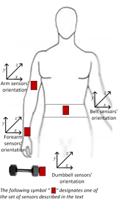

# I Pick Things Up and Put Things Down

```{r}
library("knitr")
library("ggplot2")
library("ggthemes")
opts_chunk$set(fig.width=8, fig.height=2)
set.seed(2718)
```

## Executive Summary

This is a toy analysis of a data set from the Human Activity Recognition project.  The goal was predicting an athlete's form `classe` based on 159 sensor readings attached to body parts and weights.  The random forest model proved effective with an out of sample error rate estimated at 0.0056, and a perfect 100% accuracy on predictions from an additional 20 challenge samples where the true `classe` were witheld.

## Problem Statement

The use of sensors in atletic training can assist athletes quantify their form and identify areas of improvement.  The data sets used in this analysis originate from the [Human Activity Recognition](http://groupware.les.inf.puc-rio.br/har) project, and attempts to quantify the form of six athletes during barbell lifts.  The training data set consists of 159 sensor measuremnts collected in 19,622 samples and then matched to a `classe` of form ("A", "B", "C", "D", "E").  A prediction model is desired to monitor additional athletes and determine their previously unknown `classe` of form.  An additional 20 samples with `classe` information witheld are provided to evaluate the prediction model.



## Data Retrieval

Data sets have been previously collected and is availabe here in csv format:

* [training](https://d396qusza40orc.cloudfront.net/predmachlearn/pml-training.csv)
* [evaluation](https://d396qusza40orc.cloudfront.net/predmachlearn/pml-testing.csv)

```{r}
source('getdata.r')
```

## Preprocessing

In order to make the best use of the sensor data, they must be cleaned.  The training data set is loaded below via the `loaddata` function.  Since the raw data sets contain spurious entries such as "#DIV/0!", all features are initially considered character vectors and will be later mapped to the appropriate data type.

```{r}
source('preprocess.r')

df <- loaddata('data/pml-training.csv')
```

The `scrub` function performs the majority of the preprocessing work.

* Change #DIV/0! no NA
* Change empty strings no NA
* Convert features to appropriate numeric, integer, or factor types
* Drop fields with no meaninful data
* convert NAs to 0

The following features are mapped to integer vectors.

```
accel_arm_x, accel_arm_y, accel_arm_z, accel_belt_x, accel_belt_y, accel_belt_z, accel_dumbbell_x, accel_dumbbell_y, accel_dumbbell_z, accel_forearm_x, accel_forearm_y, accel_forearm_z, amplitude_pitch_belt, amplitude_yaw_arm, magnet_arm_x, magnet_arm_y, magnet_arm_z, magnet_belt_x, magnet_belt_y, magnet_belt_z, magnet_dumbbell_x, magnet_dumbbell_y, magnet_forearm_x, max_picth_belt, max_yaw_arm, min_pitch_belt, min_yaw_arm, num_window, total_accel_arm, total_accel_belt, total_accel_dumbbell, total_accel_forearm
```

The following features are mapped to numeric vectors.

```
amplitude_pitch_arm, amplitude_pitch_dumbbell, amplitude_pitch_forearm, amplitude_roll_arm, amplitude_roll_belt, amplitude_roll_dumbbell, amplitude_roll_forearm, avg_pitch_arm, avg_pitch_belt, avg_pitch_dumbbell, avg_pitch_forearm, avg_roll_arm, avg_roll_belt, avg_roll_dumbbell, avg_roll_forearm, avg_yaw_arm, avg_yaw_belt, avg_yaw_dumbbell, avg_yaw_forearm, gyros_arm_x, gyros_arm_y, gyros_arm_z, gyros_belt_x, gyros_belt_y, gyros_belt_z, gyros_dumbbell_x, gyros_dumbbell_y, gyros_dumbbell_z, gyros_forearm_x, gyros_forearm_y, gyros_forearm_z, kurtosis_picth_arm, kurtosis_picth_belt, kurtosis_picth_dumbbell, kurtosis_picth_forearm, kurtosis_roll_arm, kurtosis_roll_belt, kurtosis_roll_dumbbell, kurtosis_roll_forearm, kurtosis_yaw_arm, magnet_dumbbell_z, magnet_forearm_y, magnet_forearm_z, max_picth_arm, max_picth_dumbbell, max_picth_forearm, max_roll_arm, max_roll_belt, max_roll_dumbbell, max_roll_forearm, max_yaw_belt, max_yaw_dumbbell, max_yaw_forearm, min_pitch_arm, min_pitch_dumbbell, min_pitch_forearm, min_roll_arm, min_roll_belt, min_roll_dumbbell, min_roll_forearm, min_yaw_belt, min_yaw_dumbbell, min_yaw_forearm, pitch_arm, pitch_belt, pitch_dumbbell, pitch_forearm, roll_arm, roll_belt, roll_dumbbell, roll_forearm, skewness_pitch_arm, skewness_pitch_dumbbell, skewness_pitch_forearm, skewness_roll_arm, skewness_roll_belt, skewness_roll_belt.1, skewness_roll_dumbbell, skewness_roll_forearm, skewness_yaw_arm, stddev_pitch_arm, stddev_pitch_belt, stddev_pitch_dumbbell, stddev_pitch_forearm, stddev_roll_arm, stddev_roll_belt, stddev_roll_dumbbell, stddev_roll_forearm, stddev_yaw_arm, stddev_yaw_belt, stddev_yaw_dumbbell, stddev_yaw_forearm, var_accel_arm, var_accel_dumbbell, var_accel_forearm, var_pitch_arm, var_pitch_belt, var_pitch_dumbbell, var_pitch_forearm, var_roll_arm, var_roll_belt, var_roll_dumbbell, var_roll_forearm, var_total_accel_belt, var_yaw_arm, var_yaw_belt, var_yaw_dumbbell, var_yaw_forearm, yaw_arm, yaw_belt, yaw_dumbbell, yaw_forearm
```

And the following features dropped due to their lack of useful information.

```
amplitude_yaw_belt, amplitude_yaw_dumbbell, amplitude_yaw_forearm, kurtosis_yaw_belt, kurtosis_yaw_dumbbell, kurtosis_yaw_forearm, new_window, raw_timestamp_part_1, raw_timestamp_part_2, skewness_yaw_belt, skewness_yaw_dumbbell, skewness_yaw_forearm
```

```{r}
df <- scrub(df)
```

## Training/Testing/Validation Data Sets for Modelling

After the data.frame was preprocessed, the samples were broken into a training, testing, and validation data sets in approximately 60%, 20%, 20% respectively.  The work in the Modelling section is limited to training models off the 60% training data and based on the 20% testing data set.  The out of sample error rate for the final model selected is later estimated with the remaining 20% validation data set.

```{r}
splits <- splitdataset(df)
print(splits$table)

training <- df[splits$x == 0,]
testing <- df[splits$x == 1,]
validation <- df[splits$x == 2,]
```

## Modelling

Manual inspection of the features in the training data set showed mainly atypical distributions.  Some like `accel_arm_x` which quantifies acceleration of the upper arm along the x-axis displays common profiles between `classes`, but does not natually fit into standard probability distributions.

```{r, message=FALSE, echo=FALSE, error=FALSE}
ggplot(training, aes_string(x="accel_arm_x", y="..density..", colour = "classe")) + geom_freqpoly()
```

Additional features such as `magnet_dumbbell_y` and `min_pitch_forearm` are sparsely populated.

```{r, message=FALSE, echo=FALSE, error=FALSE}
ggplot(training, aes_string(x="magnet_dumbbell_y", y="..density..", colour = "classe")) + geom_freqpoly()

ggplot(training, aes_string(x="min_pitch_forearm", y="..density..", colour = "classe")) + geom_freqpoly()
```

Given that distributions are either sparse or atypical, models build off of distance metrics and similarity scores would likely not be very effective without a lot of work to develop an unbiased distance metric.  Classification methods that generally perform well without requiring a universal distance metric are the decision tree and random forest. 

### Decision Tree

Initial model selection was based of the single decision tree using the recursive partition, `rpart`, library.

```{r}
library(rpart)
dtfit_train <- rpart(classe ~ ., data=training, method="class")
```

The first node of the decision tree splits on `roll_belt = 130.5` which does an adequate job in the training data set of separating out some "E" classes.

```{r, message=FALSE, echo=FALSE, error=FALSE}
ggplot(training, aes_string(x="roll_belt", y="..density..", colour = "classe")) + geom_freqpoly()
```

Using the model with the testing data set yields matches of

```{r}
dtpredict_training <- predict(dtfit_train, training, type="class")
cf <- table(true = training$classe, pred = dtpredict_training)
print(round(cf / sum(cf) * 100, 2))
```

The accuracy for the single decision tree is `r round(sum(training$classe == dtpredict_training) / length(training$classe) * 100, 1)`% and can likely be improved with running multiple decision trees in a random forest.


### Random Forest

A random forest was created with 100 decision trees where the strenghts and weaknesses of individual decision trees can be weighted to increase the overall accuacy of the classifier. 

```{r, message=FALSE}
library(randomForest)
rffit_train <- randomForest(classe ~ ., data=training, method="class", ntree=100)
```

The model wass assessed based on the testing data by comparing predicted `classe` with known `testing$classe`.

```{r}
rfpredict_testing <- predict(rffit_train, testing, type="class")
```

The model's accuracy on the testing data is `r round(sum(testing$classe == rfpredict_testing) / length(testing$classe) * 100, 2)`% with the associated confusion matrix.

```{r}
cf <- table(true = testing$classe, pred = rfpredict_testing)
print(round(cf / sum(cf) * 100, 2))
```

### Out of Sample Error

The validation set was used once to estimate an out of sample error rate of

```{r}
rfpredict_validation <- predict(rffit_train, validation, type="class")
1- sum(validation$classe == rfpredict_validation) / length(validation$classe)
```

## Problem Set

A predition of `classe` was performed on the 20 additional samples where the `classe` were witheld.  The resulting predictions were a 100% match to the actual values when submitted for comparison, which was in line with the expected out of sample error rates.

```{r}
# Load the problem set
problems <- loaddata('data/pml-testing.csv')
# Preprocess the data.frame
problems <- scrub(problems)
# Predict the classe
problems.pred <- predict(rffit_train, problems, type="class")

# Write predictions out to file
pml_write_files = function(x){
  n = length(x)
  for(i in 1:n){
    filename = paste0("solutions/problem_id_",i,".txt")
    write.table(x[i],file=filename,quote=FALSE,row.names=FALSE,col.names=FALSE)
  }
}
pml_write_files(problems.pred)
```
